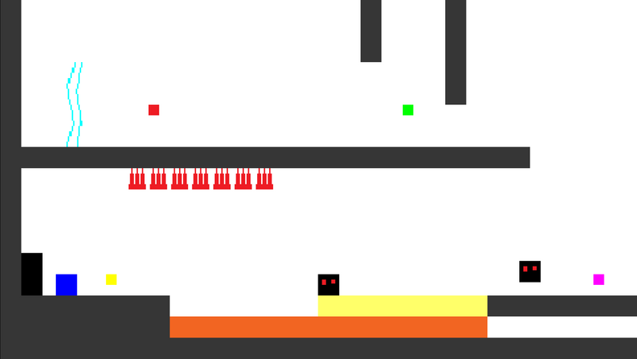
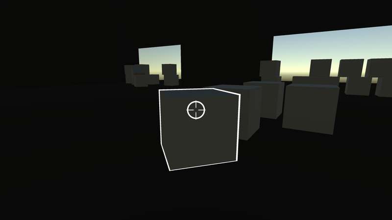
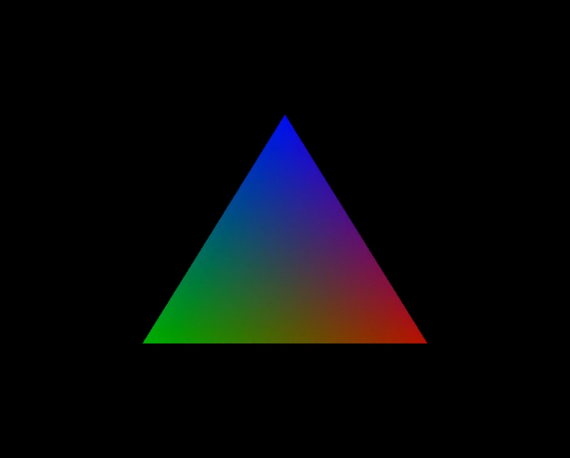

# GameMaker
---

One of my first projects was called Blink. The idea was a fast-paced platformer where you changed colour in order to access different abilities, and pass through blocks.

# Unity
---

I spent ~18 months in Unity from July 2017, and started upwards of 20 different projects.

My favourite, mechanically, was a jam game where you had to survive against invisible enemies. You could move boxes around for the enemies to bump into. If you lost them round a corner, they'd move to your last known location and rotate towards the direction you went.

# C and OpenGL
---

Inspired by Scott H. Young's book, Ultralearning[^2], and the creator of Stardew Valley[^3], Eric Barone, I've decided to create a game from scratch in C.

The goal is to bolster my portfolio as, while I have been programming since 2017, I don't have many complete projects to show for it. I'll also be learning computer graphics, pixel art, and how to sell.

# References
[^1]: [id Software]()
[^1]: I created a tool for [AshleyRoboto's Twitch stream](https://www.twitch.tv/AshleyRoboto) that spawns an animated carriage for each level of a hype train
[^2]: [Ultralearning](https://www.scotthyoung.com/blog/ultralearning/) by Scott H. Young
[^3]: [Stardew Valley](https://store.steampowered.com/app/413150/Stardew_Valley/)
